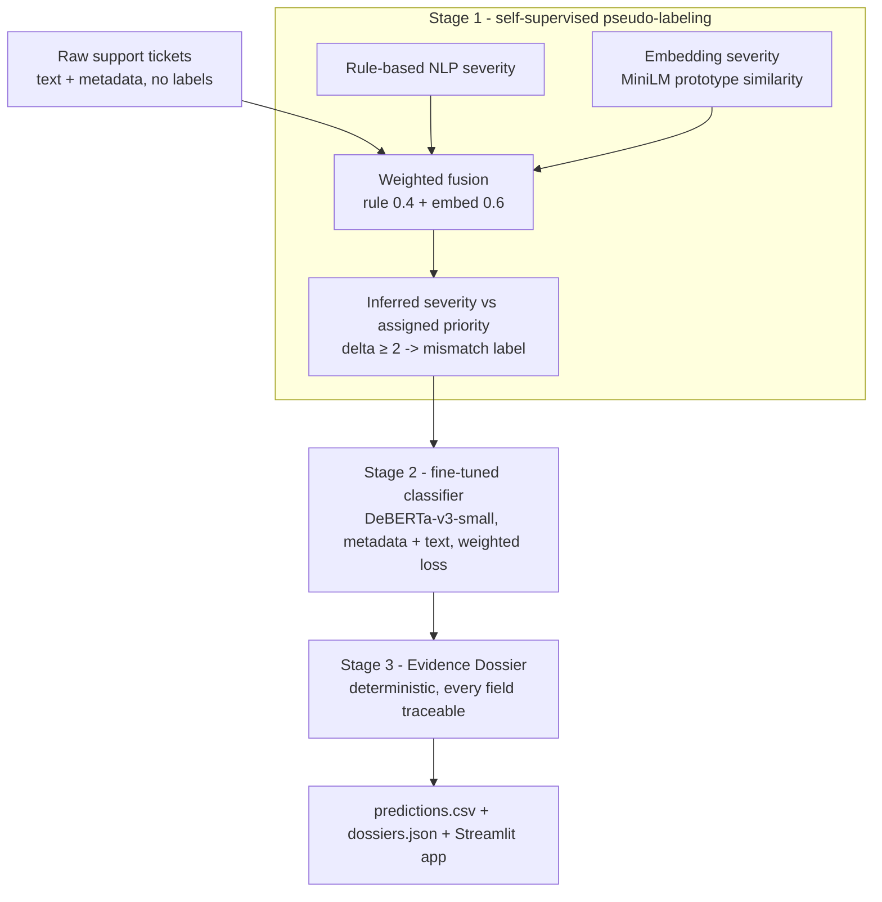

# Support Integrity Auditor (SIA)

An evidence-grounded auditor that detects **Priority Mismatch** in customer-support
tickets: cases where the objective severity of a ticket's content conflicts with its
human-assigned priority. There are no ground-truth mismatch labels in the data, so the
system bootstraps its own supervision signal, trains a classifier on it, and produces a
hallucination-free Evidence Dossier for every flagged ticket.

- **Hosted app:** https://supportintegrityauditor23123042-gydbcmvcqkmyszy3pidahv.streamlit.app/
- **Model:** [`Darkrai17/sia-deberta`](https://huggingface.co/Darkrai17/sia-deberta)

## Pipeline



A third signal, **resolution time**, is computed and reported but excluded from the
fusion because it agreed with the semantic signals only at chance level on this dataset
(see ablation below).

## Repository layout

```
support_integrity_auditor/
├── app.py                     Streamlit app (single-ticket + batch + dashboard)
├── notebook.ipynb             Reproducible pipeline: Stage 1 -> 2 -> 3
├── requirements.txt           Runtime dependencies
├── data/                      (Add dataset as required)
├── .streamlit/config.toml     App theme
└── src/
    ├── config.py              Column normalization + severity ordinal scale
    ├── pseudo_labeling.py     Stage 1 - signal fusion + mismatch labels
    ├── train_pipeline.py      Stage 2 - DeBERTa-v3-small fine-tuning
    ├── dossier.py             Stage 3 - deterministic dossier builder
    └── predict.py             Inference: CSV -> predictions + dossiers
```

## Dataset

Customer Support Tickets CRM dataset (20,000 tickets). Key fields used: ticket
subject, ticket description, assigned priority (Low / Medium / High / Critical),
channel, issue category, and resolution time. Priority distribution is skewed
(Low 39%, Medium 38%, High 17%, Critical 6%).

## Methodology

### Stage 1 - pseudo-label generation (self-supervised)

Each ticket is assigned an inferred severity on a 0-3 scale, independent of its
assigned priority, by fusing two independent signals:

- **Rule-based NLP severity** - a tiered escalation lexicon (critical / high / medium /
  low) with negation handling; matched terms are stored for later traceability.
- **Embedding severity** - the ticket text is embedded with `all-MiniLM-L6-v2` and
  scored by cosine similarity to per-tier prototype phrases (a label-free, semantic
  urgency signal that is robust to keyword spoofing).

The fused severity is compared to the assigned priority; a binary **mismatch** label is
set when the ordinal gap is at least 2. The direction gives the mismatch type:
*Hidden Crisis* (content more severe than the label) or *False Alarm* (content less
severe than the label).

**Fusion ablation** (held-out comparison of the signals):

| Measure | Value |
|---|---|
| Pairwise agreement: rule ~ embed | 0.670 |
| Pairwise agreement: rule ~ rtime | 0.247 |
| Pairwise agreement: embed ~ rtime | 0.248 |
| Label agreement when **rule** dropped | 0.982 |
| Label agreement when **embed** dropped | 0.879 |

The embedding signal carries the most weight (dropping it changes the most labels), the
rule signal is a complementary lexical check, and resolution time is excluded for
agreeing only at chance level (~0.25 for 4 bins). Resulting label balance:
**13,524 Consistent / 6,476 Mismatch** (32.4% flagged).

### Stage 2 - classifier (fine-tuned)

A `microsoft/deberta-v3-small` model is fine-tuned for binary classification. Each
input serializes the structured metadata in front of the text:

```
priority: High | channel: Chat | type: Technical | resolution_time: 41 | <subject>. <description>
```

Including the assigned priority is essential: the mismatch label is a comparison between
content severity and that priority, so the model needs it as an input. This also
satisfies the requirement that inputs include text plus a structured metadata feature.
Class imbalance is handled with a weighted cross-entropy loss (weights 0.74 / 1.54).

### Stage 3 - Evidence Dossier

For every ticket the model flags, a dossier is built **deterministically** from the
Stage-1 signal values (matched keywords, embedding score, resolution time) plus the
model's confidence. Nothing is free-form generated, so every `feature_evidence` item is
traceable to a concrete field by construction - zero hallucination.

```json
{
  "ticket_id": "TKT-100003",
  "assigned_priority": "Low",
  "inferred_severity": "High",
  "mismatch_type": "Hidden Crisis",
  "severity_delta": 2,
  "feature_evidence": [
    {"signal": "keyword", "value": "failed", "weight": "high"},
    {"signal": "embedding", "value": 2.51, "interpretation": "text semantically closest to Critical-severity tickets"},
    {"signal": "resolution_time", "value": 41, "interpretation": "reported resolution hours (context only; not weighted)"}
  ],
  "constraint_analysis": "Assigned priority is Low, but the fused signals infer High severity (delta +2). The text shows escalation cues \"failed\" and an embedding profile nearest Critical-severity content. Because the inferred severity exceeds the assigned Low label, this is flagged as a Hidden Crisis (under-prioritized).",
  "confidence": 0.9999
}
```

## Results (held-out test split, n = 3,000)

| Metric | Result | Threshold | Pass |
|---|---|---|---|
| Accuracy | **0.979** | ≥ 0.83 | yes |
| Macro F1 | **0.976** | ≥ 0.82 | yes |
| Recall (Consistent) | **0.990** | ≥ 0.78 | yes |
| Recall (Mismatch) | **0.956** | ≥ 0.78 | yes |

Confusion matrix `[[2008, 20], [43, 929]]` (rows = true, cols = predicted; classes
Consistent, Mismatch). All verification thresholds met.

## Reproduce

Run `notebook.ipynb` top to bottom (Google Colab with a T4 GPU recommended). It runs
Stage 1, trains and evaluates Stage 2, and generates dossiers. Equivalent command-line
scripts:

```bash
pip install -r requirements.txt

# Stage 1
python src/pseudo_labeling.py --input data/customer_support_tickets.csv \
    --output data/tickets_pseudolabeled.csv --report data/stage1_report.json

# Stage 2
python src/train_pipeline.py --input data/tickets_pseudolabeled.csv \
    --model_dir models/sia_deberta --metrics data/stage2_metrics.json

# Inference (CSV -> predictions + dossiers)
python src/predict.py --input data/customer_support_tickets.csv \
    --model_dir models/sia_deberta \
    --predictions data/predictions.csv --dossiers data/dossiers.json
```

## Run the app

```bash
streamlit run app.py
```

Set the model field in the sidebar to a local path (`models/sia_deberta`) or the Hugging
Face repo id (`Darkrai17/sia-deberta`).

## Author:
- Sumit Sharma
- Engineering Physics
- 23123042
